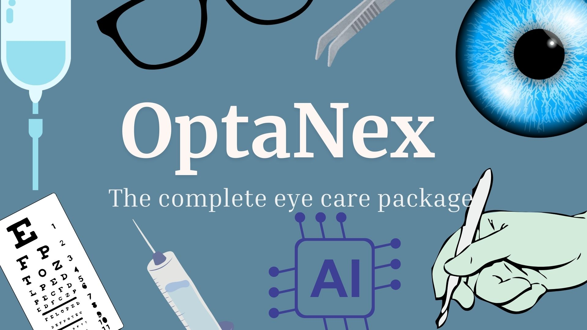

👁️ OptaNex
Smart Vision Starts Here

  
 
     

📌 About OptaNex

OptaNex is a Progressive Web App (PWA) designed to make eye care smart, accessible, and affordable.
It combines AI-powered disease prescreening, vision testing, eye health tracking, and digital wellness tools into one unified platform.

🎯 Built especially for low-access and underserved communities, OptaNex focuses on early detection, continuous monitoring, and proactive eye care.

🚨 Problem Statement

Eye diseases like Diabetic Retinopathy (DR) and Age-related Macular Degeneration (AMD) are often detected too late.

Existing solutions are:

Disease-specific

Expensive

Hardware-heavy

Limited to clinical environments

👉 OptaNex bridges this gap with a low-cost, smartphone-based, AI-driven solution.

✨ Key Features
🧠 OptiScreen – AI Eye Screening

📷 Upload fundus images (JPG/PNG)

🤖 AI prescreening for:

Diabetic Retinopathy (DR)

Age-related Macular Degeneration (AMD)

📊 Risk grading (0–4) with advisory insights
⚠️ Educational & advisory only — not a medical diagnosis

👓 Vision Testing

👁️ Snellen Chart Test – Visual acuity measurement

🎨 Ishihara Test – Color vision deficiency screening

📋 Step-by-step guided instructions for accuracy

📈 OptiTrack – Vision Power Tracker

Track vision power (spherical, cylindrical, axis)

Visualize trends with charts & graphs

Maintain long-term eye health records

📑 PrescriptTracker

Upload & store prescriptions

Chronological, secure access

Easy sharing during consultations

🗂️ EyeChronicle

Record treatments, surgeries, and medications

Maintain a complete ocular medical history

Structured & easy retrieval

🌙 GlareGuard – Digital Eye Wellness

⏱️ Screen time monitoring

📊 Usage analytics & graphs

🔔 20-minute blue light break reminders

Promotes healthy screen habits

🚀 Innovation & Novelty

✅ Multi-functional platform (not single-disease)
✅ Dual AI detection (DR + AMD)
✅ Low-cost screening using a smartphone + 20D lens
✅ Home-based & scalable
✅ Privacy-first (DPDP 2023 compliant)

🛠️ Tech Stack
Frontend

⚛️ React.js

🎨 Tailwind CSS / ShadCN UI

📱 Progressive Web App (PWA)

Backend & AI

⚙️ FastAPI

🗄️ Supabase

🧠 TensorFlow, Keras, Scikit-learn

🖼️ OpenCV

📊 Pandas

🔍 Grad-CAM (Explainability)

Models

EfficientNetB0

CNN

Swin Transformers

🚀 Getting Started

Follow the steps below to clone and run OptaNex locally for development or personal use.

Prerequisites

Ensure you have the following installed:

Node.js (v18 or later recommended)

npm or yarn

Git

A modern web browser (Chrome / Firefox)

(Optional) Python 3.9+ for running the AI backend

Clone the Repository
git clone https://github.com/<your-username>/optanex.git
cd optanex

Install Dependencies
npm install

or

yarn install

Environment Setup

Create a .env file in the root directory and configure the required variables:

VITE_BACKEND_URL=http://localhost:8000
VITE_GET_ALL_BOT_ROUTE=/api/bots

(Update values based on your backend or Supabase configuration.)

Run the Frontend (PWA)
npm run dev

The app will be available at:

http://localhost:5173

You can install OptaNex as a Progressive Web App (PWA) directly from the browser for an app-like experience.

Backend & AI Services (Optional)

OptaNex supports AI-based prescreening using FastAPI and deep learning models for DR and AMD detection.

To run the backend:

cd backend
pip install -r requirements.txt
uvicorn main:app --reload

Ensure your backend URL matches the frontend .env configuration.

Using OptaNex

Upload retinal fundus images for AI-based prescreening

Perform vision acuity (Snellen) and color blindness (Ishihara) tests

Track vision power and prescriptions

Monitor screen time and blue light exposure

Manage long-term eye health records securely

⚠️ Disclaimer: OptaNex provides preliminary screening and advisory insights only. It is not a medical diagnostic tool. Always consult a certified ophthalmologist for clinical decisions.

Fully compliant with DPDP Act 2023

User-controlled data

Secure authentication & storage via Supabase

📊 Results & Impact

AI-generated risk reports for DR & AMD

Visual analytics for long-term vision tracking

Digital medical record management

Encourages early detection & preventive care

👩‍💻 Team

Supervisor
👨‍🏫 Dr. Pratosh Kumar Pal

Group Members

Heeral Jiwnani – 24BHI10009

Pankhuri Shrivastava – 24BHI10005

Siya Sanjit Sawant Dessai – 24BHI10083

Salvin P V – 24BHI10110

🌱 Future Scope

Doctor dashboard & teleconsultation

Multi-language accessibility

Wearable integration

Clinical validation & deployment

📚 References

Mayo Clinic – Diabetic Retinopathy & AMD

MDPI – AdaptiveSwin-CNN

National Eye Institute

Ishihara Color Blindness Test

⭐ Final Note

OptaNex is not just an app — it’s a step toward democratizing eye care.

If this project helped or inspired you, consider ⭐ starring the repo.